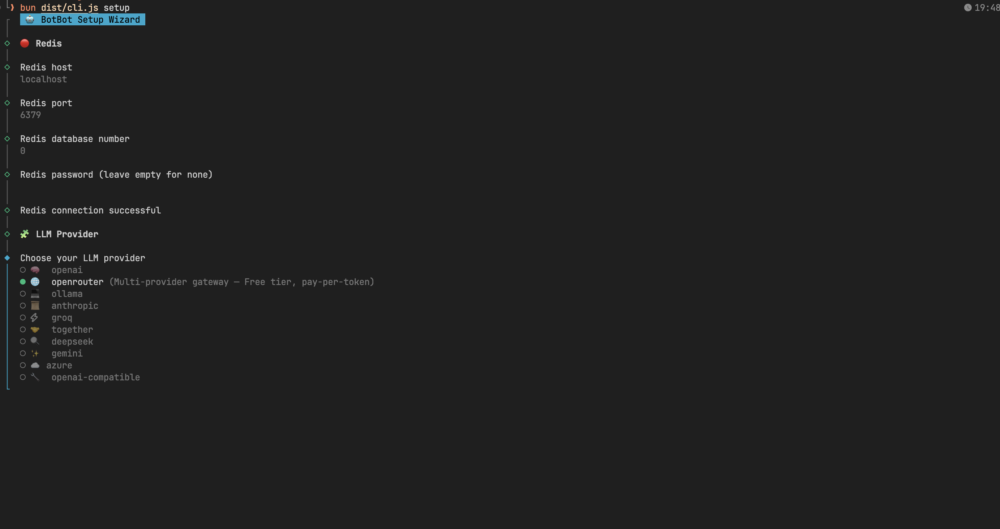
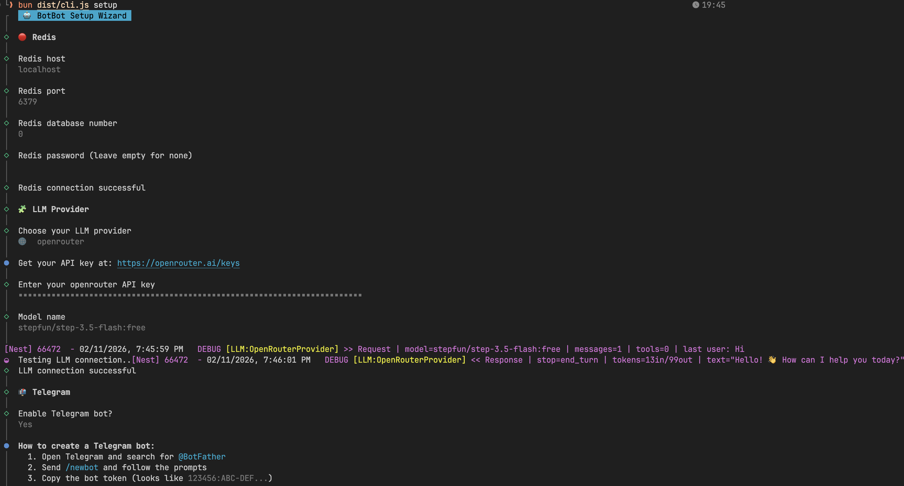
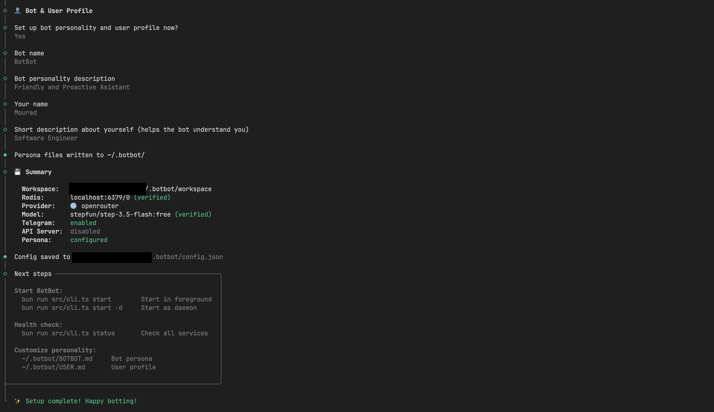
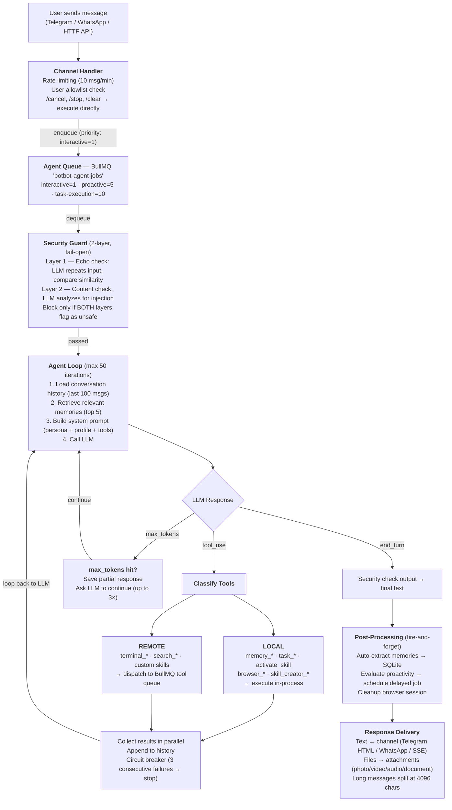
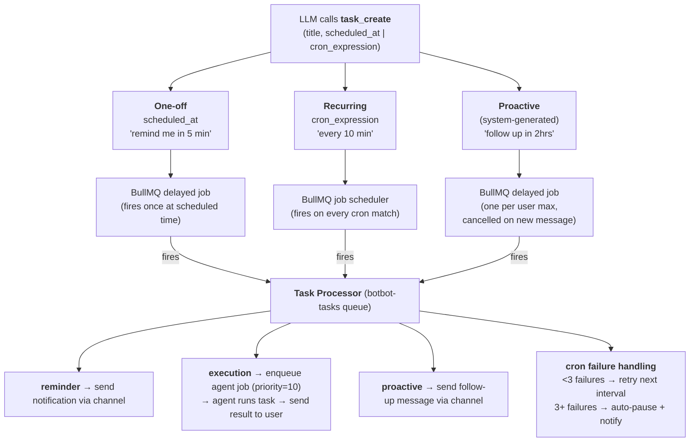
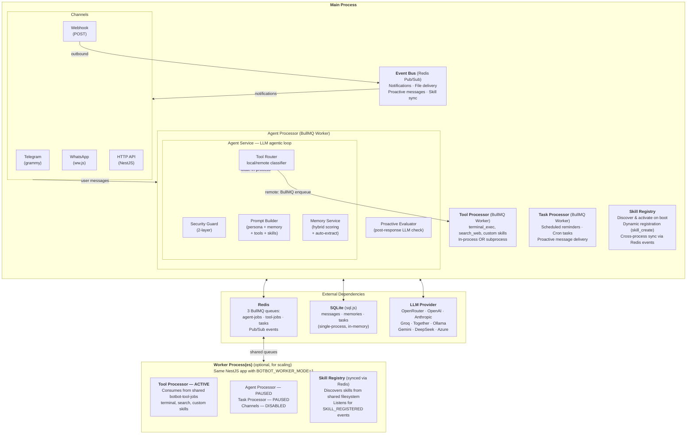

# BotBot

A personal AI assistant that operates across Telegram, WhatsApp, and HTTP API. Features long-term memory, task scheduling, proactive messaging, a security guard, and an extensible skill system with terminal, browser, and web search built in.

Built with NestJS, TypeORM (SQLite), BullMQ (Redis), and multi-provider LLM support.

---

## Quick Start

### Prerequisites

- [Bun](https://bun.sh) (v1.1+)
- [Redis](https://redis.io) (running locally or remote)
- An LLM API key -- [OpenRouter](https://openrouter.ai) offers free models, no credit card needed

### 1. Install Bun

```bash
# macOS / Linux
curl -fsSL https://bun.sh/install | bash

# Windows (via PowerShell)
powershell -c "irm bun.sh/install.ps1 | iex"
```

### 2. Install Redis

<details>
<summary>Docker</summary>

```bash
docker run -d --name redis -p 6379:6379 --restart unless-stopped redis:7-alpine
```
</details>

<details>
<summary>macOS (Homebrew)</summary>

```bash
brew install redis
brew services start redis
```
</details>

<details>
<summary>Linux (Ubuntu/Debian)</summary>

```bash
sudo apt update && sudo apt install -y redis-server
sudo systemctl enable redis-server --now
```
</details>

<details>
<summary>Linux (Arch)</summary>

```bash
sudo pacman -S redis
sudo systemctl enable redis --now
```
</details>

<details>
<summary>Windows</summary>

Redis doesn't run natively on Windows. Use one of these options:

- **Docker Desktop** (recommended): Install [Docker Desktop](https://www.docker.com/products/docker-desktop/), then run the Docker command above
- **WSL2**: Install Ubuntu via WSL2, then use the Linux instructions above
</details>

Verify: `redis-cli ping` should respond `PONG`.

### 3. Install & Build

```bash
git clone https://github.com/mourad-ghafiri/BotBot && cd BotBot
bun install
bun run build
```

### 4. Setup

```bash
bun run botbot setup
```

The interactive wizard walks you through Redis, LLM provider, channels (Telegram, WhatsApp, webhook), HTTP API, skills (terminal, browser, search, skill creator), and bot/user profile configuration. All connections are tested live.

<p align="center">
  
  
  
</p>

### 5. Start

```bash
bun run botbot start
```

That's it. Open Telegram (or your configured channel) and send a message.

---

## Free Setup (OpenRouter + Telegram)

You can run BotBot completely free using OpenRouter's free models and a Telegram bot.

**1. Get a free OpenRouter API key**

Go to [openrouter.ai/keys](https://openrouter.ai/keys), create an account (GitHub/Google sign-in), and create a key. No credit card required.

**2. Create a Telegram bot**

Message [@BotFather](https://t.me/BotFather) on Telegram, send `/newbot`, choose a name and username. Copy the bot token.

**3. Find your Telegram user ID**

Message [@userinfobot](https://t.me/userinfobot) -- it replies with your numeric user ID.

**4. Run setup and start**

```bash
bun run botbot setup    # select openrouter, paste key, use a free model, paste telegram token + user ID
bun run botbot start
```

Some free models (append `:free` to the model ID):

| Model | ID |
|-------|----|
| StepFun Step 3.5 Flash | `stepfun/step-3.5-flash:free` |
| Arcee AI: Trinity Large Preview | `arcee-ai/trinity-large-preview:free` |
| Z.ai: GLM 4.5 Air | `z-ai/glm-4.5-air:free` |

Browse all free models at [openrouter.ai/models?q=free](https://openrouter.ai/models?q=free).

> **Note:** Free models may have lower rate limits and reduced tool-calling reliability. For best results with skills (terminal, browser, search), a model with strong tool use is recommended.

---

## Features

### Long-term Memory

BotBot remembers things across conversations using hybrid retrieval scoring:

- **Storage:** SQLite with category (personal, preference, project, decision, system, general), tags, importance (0-1)
- **Retrieval:** Term matching + recency boost + importance boost + access frequency boost
- **Deduplication:** Significant-word overlap detection before storing
- **Auto-extraction:** After each conversation turn, an LLM extracts facts worth remembering (non-blocking)
- **Injection:** Top N relevant memories injected into the system prompt before each LLM call

### Task Scheduling

The LLM can create reminders and execution tasks on your behalf:

| Type | Behavior |
|------|----------|
| **Reminder** | Sends a notification at the scheduled time |
| **Execution** | Runs the agent with the task description as prompt, returns the result |

- **One-off:** schedule for a specific date/time
- **Recurring:** cron expressions (e.g. `0 9 * * 1-5` for weekdays at 9 AM)
- **Restart-safe:** all jobs are persisted in Redis via BullMQ

### Proactive Messaging

After each response, a background LLM evaluation decides whether a follow-up would be helpful. If so, it schedules a delayed message (30 minutes to 24 hours). New user messages auto-cancel pending follow-ups.

One proactive job per user max. Conservative by design -- only follows up when genuinely useful.

Enable with `agent.proactive.enabled: true` (disabled by default).

### Security Guard

Two-layer input/output validation protects against prompt injection and data exfiltration:

| Layer | Method | Detects |
|-------|--------|---------|
| **Echo check** | LLM repeats input, compare similarity | Prompt injection (hidden instructions) |
| **Content check** | LLM analyzes for attacks | System attacks, data exfiltration |

Blocks only if both layers flag the input. Fail-open on errors. Output also validated.

### Skills

Skills are activated on demand by the LLM calling `activate_skill` -- progressive disclosure keeps the tool list clean.

**Builtin skills:**

| Skill | Tools | Description |
|-------|-------|-------------|
| `terminal` | `terminal_exec`, `terminal_background`, `terminal_output`, `terminal_kill` | Shell command execution with timeout and deny list |
| `browser` | `browser_open`, `browser_screenshot`, `browser_navigate`, ... | Web automation via Playwright (default or CDP mode) |
| `search` | `search_web`, `search_news`, `search_images`, ... | DuckDuckGo web search |
| `skill_creator` | `skill_create` | Create new custom skills at runtime |

**Browser modes:**

| Mode | Binary | Profile | Connection |
|------|--------|---------|------------|
| `default` | Playwright bundled Chromium | Fresh each time | `playwright.chromium.launch()` |
| `cdp` | System Chrome/Chromium | Persistent (`{workspace}/browser_profile`) | Chrome DevTools Protocol via `connectOverCDP()` |

In CDP mode, the system Chrome is launched at bot startup with a persistent user data directory and stays alive for the entire bot lifetime. Pages persist between agent runs -- follow-up requests reuse existing tabs. Workers connect to the same Chrome instance via CDP without spawning their own.

**Custom skills:** The LLM can create new skills via `skill_creator`. Skills are stored in `~/.botbot/skills/` and registered immediately. Each skill is a directory with `tools.json` (tool definitions) and `scripts/` (executable handlers).

Builtin skills are synced to `~/.botbot/skills/` on startup so users can customize them.

---

## Channels

### Telegram

1. Message [@BotFather](https://t.me/BotFather), send `/newbot`, pick a name and username
2. Copy the bot token (e.g. `123456789:ABCdefGHI...`)
3. Get your user ID from [@userinfobot](https://t.me/userinfobot)
4. Enter both during `bun run botbot setup`, or add to `~/.botbot/config.json`:

```jsonc
"telegram": {
  "enabled": true,
  "token": "123456789:ABCdefGHIjklMNOpqrsTUVwxyz",
  "allowed_users": [123456789]  // empty [] = allow all (not recommended)
}
```

Features: text/file/media sending (HTML formatting), per-user rate limiting, user whitelist.

### WhatsApp

- QR code authentication via whatsapp-web.js
- Text and media sending
- Allowed numbers whitelist

### HTTP API

Enable with `server.enabled: true` in config.

| Endpoint | Description |
|----------|-------------|
| `POST /api/chat` | Send a message (SSE streaming: status, progress, response, files, done) |
| `POST /api/chat/cancel` | Abort the current agent loop |
| `POST /api/chat/stop` | Stop current tool execution (agent loop continues) |
| `GET /api/skills` | List active skills |
| `POST /api/session/clear` | Clear conversation context |

Protected by API key authentication.

### Webhook

Outbound HTTP POST to a callback URL with HMAC-SHA256 signature. Payload types: message, notification, file.

---

## LLM Providers

10 providers supported out of the box:

| Provider | Default Model | API Key Required |
|----------|--------------|-----------------|
| OpenRouter | `anthropic/claude-sonnet-4` | Yes |
| OpenAI | `gpt-4o` | Yes |
| Anthropic | `claude-sonnet-4-20250514` | Yes |
| Groq | `llama-3.3-70b-versatile` | Yes |
| Together | `meta-llama/Llama-3.3-70B-Instruct-Turbo` | Yes |
| DeepSeek | `deepseek-chat` | Yes |
| Gemini | `gemini-2.0-flash` | Yes |
| Azure OpenAI | `gpt-4o` | Yes (+ base URL) |
| Ollama | `llama3.1` | No (local) |
| OpenAI-Compatible | `gpt-4o` | No (+ base URL) |

All providers implement the same interface. Switch providers by changing `llm.provider` and `llm.model` in config.

### Load Balancing / Failover

Configure multiple LLM providers for round-robin load balancing with automatic failover. If one provider fails, the request is retried on the next available provider. Set `llm` to an array in config:

```jsonc
"llm": [
  {
    "provider": "openrouter",
    "api_key": "sk-or-...",
    "model": "anthropic/claude-sonnet-4",
    "temperature": 0.7,
    "max_tokens": 4096,
    "tool_enabled": true
  },
  {
    "provider": "anthropic",
    "api_key": "sk-ant-...",
    "model": "claude-sonnet-4-20250514",
    "temperature": 0.7,
    "max_tokens": 4096,
    "tool_enabled": true
  }
]
```

- **Round-robin**: each request goes to the next provider in order
- **Failover**: if a provider errors, the request is automatically retried on remaining providers
- **Backward compatible**: a single object still works (no array needed for one provider)
- **Setup wizard**: `bun run botbot setup` prompts to add additional providers after the first
- **Status check**: `bun run botbot status` tests each provider individually

---

## CLI Reference

All commands are run with `bun run botbot <command>`. A preflight check (config, Redis, workspace) runs automatically before `start`, `restart`, and `worker start`.

### `botbot setup`

Interactive setup wizard. Walks through Redis, LLM provider, channels, HTTP API, skills, and bot/user profile. Tests connections live. Writes `~/.botbot/config.json`.

```bash
bun run botbot setup
```

### `botbot start`

Start BotBot. Handles agent jobs, tool jobs, scheduled tasks, and listens on all enabled channels.

```bash
bun run botbot start          # foreground (logs to stdout)
bun run botbot start -d       # background daemon (logs to ~/.botbot/logs/botbot.log)
```

| Flag | Description |
|------|-------------|
| `-d, --daemon` | Run as a detached background process |

### `botbot stop`

Stop the background daemon. Sends SIGTERM, waits up to 5s, then SIGKILL if needed.

```bash
bun run botbot stop
```

### `botbot restart`

Stop the running daemon (if any), then start again.

```bash
bun run botbot restart        # foreground
bun run botbot restart -d     # background daemon
```

| Flag | Description |
|------|-------------|
| `-d, --daemon` | Restart as a detached background process |

### `botbot status`

Comprehensive health check: config, Redis, LLM provider, Telegram, persona files, workspace, daemon, workers.

```bash
bun run botbot status
```

```
  BotBot Health Check

   PASS   Config file    ~/.botbot/config.json
   PASS   Redis          localhost:6379
   PASS   LLM provider   openrouter / anthropic/claude-sonnet-4
   PASS   Telegram       @MyBotUsername
   PASS   BOTBOT.md      ~/.botbot/BOTBOT.md
   PASS   USER.md        ~/.botbot/USER.md
   PASS   Workspace      ~/.botbot/workspace
   PASS   Daemon         PID 12345
   PASS   Workers        2 running

  All 9 checks passed
```

### `botbot logs`

View application logs.

```bash
bun run botbot logs           # last 50 lines
bun run botbot logs -n 100    # last 100 lines
bun run botbot logs -f        # follow (tail -f)
bun run botbot logs -f -n 200 # follow, starting from last 200 lines
```

| Flag | Description |
|------|-------------|
| `-f, --follow` | Stream new log lines as they are written |
| `-n, --lines <number>` | Number of lines to display (default: 50) |

### `botbot worker`

Manage worker processes for scaling tool execution. Workers are the **same NestJS application** running in tool-only mode -- they process tool jobs from the shared BullMQ queue but skip channels, agent processing, and task scheduling.

Workers are **optional**. The main process already handles tool jobs. Use workers when you need extra capacity for heavy or parallel tool execution.

#### `botbot worker start`

Start a new worker. Daemon workers get an auto-assigned ID (gap-filling).

```bash
bun run botbot worker start            # foreground, default concurrency
bun run botbot worker start -c 5       # foreground, 5 concurrent tool jobs
bun run botbot worker start -d         # background daemon, auto-assigned ID
bun run botbot worker start -d -c 5    # background daemon, 5 concurrent tool jobs
```

| Flag | Description |
|------|-------------|
| `-c, --concurrency <number>` | Concurrent tool jobs this worker handles (default: 3) |
| `-d, --daemon` | Run as a detached background process |

The `-c` flag overrides the `tool_concurrency` config value for that worker.

#### `botbot worker stop`

Stop one or all worker daemons.

```bash
bun run botbot worker stop 1       # stop worker 1
bun run botbot worker stop all     # stop all workers
```

#### `botbot worker restart`

Restart a worker daemon with the same ID.

```bash
bun run botbot worker restart 1         # default concurrency
bun run botbot worker restart 1 -c 5    # custom concurrency
```

| Flag | Description |
|------|-------------|
| `-c, --concurrency <number>` | Concurrent tool jobs (default: 3) |

#### `botbot worker list`

List all workers with status. Stale PID files are cleaned up automatically.

```bash
bun run botbot worker list
```

```
  ID      PID       Status      Uptime
  ------------------------------------
  1       45231     running     2h 15m
  2       45298     running     1h 30m
```

#### `botbot worker logs`

View logs for a specific worker.

```bash
bun run botbot worker logs 1           # last 50 lines
bun run botbot worker logs 1 -f        # follow
bun run botbot worker logs 2 -n 200    # last 200 lines
```

| Flag | Description |
|------|-------------|
| `-f, --follow` | Stream new log lines as they are written |
| `-n, --lines <number>` | Number of lines to display (default: 50) |

### Example: full workflow

```bash
# Setup and start
bun run botbot setup
bun run botbot start -d
bun run botbot status

# Scale with workers
bun run botbot worker start -d -c 5
bun run botbot worker start -d -c 5
bun run botbot worker list

# Monitor
bun run botbot logs -f
bun run botbot worker logs 1 -f

# Manage
bun run botbot worker restart 2 -c 10
bun run botbot worker stop all
bun run botbot stop
```

---

## Configuration

Config lives at `~/.botbot/config.json`. Created by the setup wizard. Supports `${ENV_VAR:default}` syntax for secrets.

```jsonc
{
  // Single provider (object) or multiple providers (array) for load balancing
  "llm": {
    "provider": "openrouter",           // LLM provider (see "LLM Providers" section)
    "api_key": "sk-or-...",             // API key (required for most providers)
    "model": "anthropic/claude-sonnet-4",
    "temperature": 0.7,                 // Sampling temperature
    "max_tokens": 4096,                 // Max output tokens per LLM call
    "base_url": "https://...",          // Custom API endpoint (azure, ollama, openai-compatible)
    "photo_enabled": false,             // Enable photo input support
    "audio_enabled": false,             // Enable audio input support
    "video_enabled": false,             // Enable video input support
    "document_enabled": false,          // Enable document input support
    "tool_enabled": true                // Enable tool/function calling
  },
  // Or as an array for load balancing / failover:
  // "llm": [{ "provider": "openrouter", ... }, { "provider": "anthropic", ... }],
  "agent": {
    "workspace": "/home/user/.botbot/workspace",  // Working directory for file operations
    "max_iterations": 50,               // Max agent loop iterations per request
    "max_input_length": 4096,           // Max user message length (characters)
    "history_limit": 100,               // Max conversation messages loaded per LLM call
    "security": {
      "enabled": true                   // Enable 2-layer input/output security guard
    },
    "memory": {
      "auto_retrieval": true,           // Inject relevant memories into system prompt
      "auto_extraction": true,          // Auto-extract facts after each conversation turn
      "retrieval_limit": 5              // Max memories injected per LLM call
    },
    "proactive": {
      "enabled": true                   // Enable proactive follow-up messaging
    }
  },
  "server": {
    "enabled": false,                   // Enable HTTP API server
    "ip": "0.0.0.0",                   // Listen address
    "port": 3000,                       // Listen port
    "apiKey": ""                        // API key for authentication (empty = no auth)
  },
  "channel": {
    "telegram": {
      "enabled": true,
      "token": "123456:ABC...",         // Bot token from @BotFather
      "allowed_users": [12345678],      // User ID whitelist (empty [] = allow all)
      "rate_limit_window": 60000,       // Rate limit window in ms
      "rate_limit_max": 10              // Max messages per window per user
    },
    "whatsapp": {
      "enabled": false,
      "allowed_numbers": []             // Phone number whitelist (empty = allow all)
    },
    "webhook": {
      "enabled": false,
      "callback_url": "https://...",    // URL to POST bot responses to
      "secret": ""                      // HMAC-SHA256 signing secret (empty = no signing)
    }
  },
  "queue": {
    "redis_url": "redis://localhost:6379/0",
    "key_prefix": "botbot:",            // Redis key prefix for all BullMQ queues
    "agent_concurrency": 3,             // Max concurrent agent jobs
    "tool_concurrency": 3,              // Max concurrent tool jobs per process
    "task_concurrency": 3               // Max concurrent scheduled/cron/proactive jobs
  },
  "skills": {
    "terminal": {
      "enabled": true,
      "timeout": 300,                   // Command timeout in seconds
      "denied_commands": [              // Blocked shell commands
        "rm -rf /", "mkfs", "dd", "shutdown",
        "reboot", "halt", "poweroff", "init"
      ]
    },
    "browser": {
      "enabled": true,
      "mode": "default",               // "default" (Playwright Chromium) or "cdp" (system Chrome via CDP)
      "headless": true,                 // Run browser in headless mode
      "timeout": 60,                    // Navigation timeout in seconds
      "cdp_port": 9222                  // CDP debug port (only used in "cdp" mode)
    },
    "search": {
      "enabled": true,
      "timeout": 60                     // Search request timeout in seconds
    },
    "skill_creator": {
      "enabled": true                   // Allow LLM to create custom skills at runtime
    }
  }
}
```

### Queue config

Each BullMQ queue has its own concurrency setting:

| Field | Queue | Controls | Default |
|-------|-------|----------|---------|
| `agent_concurrency` | `botbot-agent-jobs` | Max concurrent agent jobs (LLM message processing) | `3` |
| `tool_concurrency` | `botbot-tool-jobs` | Max concurrent tool jobs per process (skill execution) | `3` |
| `task_concurrency` | `botbot-tasks` | Max concurrent scheduled/cron/proactive jobs | `3` |

### File layout

```
~/.botbot/
 |- config.json          Configuration
 |- botbot.db            SQLite database (conversations, memory, tasks)
 |- botbot.pid           App daemon PID file
 |- worker-{id}.pid      Worker daemon PID files
 |- BOTBOT.md            Bot persona (customizable)
 |- USER.md              User profile (customizable)
 |- logs/
 |   |- botbot.log       Application logs
 |   |- worker-{id}.log  Worker logs (one per daemon worker)
 |- skills/              All skills (builtin + custom)
 |   |- package.json     Skill dependencies
 |   |- node_modules/
 |   |- terminal/
 |   |- browser/
 |   |- search/
 |   |- skill_creator/
 |   |- <custom-skill>/
 |- workspace/           Agent working directory for file operations
 |   |- browser_profile/ Persistent Chrome profile (CDP mode only)
```

---

## Architecture

### Message Workflow



### Task Scheduling Workflow



### System Architecture



### How messages flow

```
Channel (Telegram, WhatsApp, HTTP API)
 |
 Command? --yes--> Execute directly (no agent, no LLM)
 |                  /skills, /memory, /tasks, /cancel, /stop, /clear
 no
 |
Agent Queue (BullMQ 'botbot-agent-jobs', priority-aware)
 |  Priority: interactive=1 > proactive=5 > task-execution=10
 |
Agent Loop (max 50 iterations):
 |-- Validate input, load history, security check, retrieve memories
 |-- Build system prompt (persona + user profile + tools + skills + context)
 |-- LLM call with messages + tools
 |   |-- tool_use: classify local/remote, execute in parallel, collect results, continue
 |   +-- end_turn: security output check, save to history, break
 |
Post-response (fire-and-forget):
 |-- Auto-extract memories
 +-- Evaluate proactive follow-up
```

**Tools available to the LLM:**

| Tool | Type | Description |
|------|------|-------------|
| `memory_store/retrieve/list/update/delete` | Local | Long-term memory CRUD |
| `task_create/list/update/cancel` | Local | Task scheduling CRUD |
| `activate_skill` | Local | Activate a skill to use its tools |
| `terminal_*`, `browser_*`, `search_*` | Remote | Dispatched to tool queue |

### System overview

```
NestJS Application
|-- Channels (Telegram, WhatsApp, HTTP API, Webhook)
|-- AgentProcessor (BullMQ Worker on 'botbot-agent-jobs')
|   +-- AgentService (LLM calls + local tool execution)
|       |-- Local tools: memory_*, task_*, activate_skill, skill_creator
|       +-- Remote tools: dispatched via BullMQ 'botbot-tool-jobs'
|-- ToolProcessor (BullMQ Worker on 'botbot-tool-jobs')
|   +-- SkillRegistryService.execute() -> terminal, browser, search, custom
|-- TaskProcessor (BullMQ Worker on 'botbot-tasks')
|   +-- TaskLifecycleService -> scheduled, cron, proactive jobs
|-- EventBusService (Redis Pub/Sub)
|-- SecurityGuard, MemoryService, PromptService, ProactiveEvaluator
+-- Database (sql.js -- single-process exclusive access)
```

**Single process by default.** The main app handles agent jobs, tool jobs, task scheduling, and channels. No separate workers needed.

**Worker mode for scaling.** `botbot worker start` runs the same NestJS app in tool-only mode (`BOTBOT_WORKER_MODE=1`). Agent and task processors are paused; only tool jobs are consumed. BullMQ distributes tool jobs across the main process and all workers automatically.

**Why local vs remote tools?** sql.js is in-memory SQLite -- only one process can access it. Memory/task tools need DB and are fast (<10ms). Skill tools are heavy (seconds), stateless, no DB needed. `skill_creator` stays local because it mutates the main process's skill registry.

### Module map

```
AppModule
 |- AppConfigModule        Config loading + Joi validation
 |- EventsModule           Redis Pub/Sub event bus (global)
 |- BullModule             BullMQ Redis connection (global)
 |- DatabaseModule         SQLite (sql.js) + TypeORM entities
 |- ConversationModule     Message history storage
 |- MemoryModule           Long-term memory (store, retrieve, extract)
 |- TaskModule             Task/reminder CRUD
 |- LLMModule              Multi-provider LLM factory + load balancing
 |- SecurityModule         Input/output security guard
 |- SkillsModule           Skill registry, loader, executor
 |- AgentModule            Core agent loop + prompt builder + proactive evaluator
 |   |- ToolDispatcher     BullMQ queue for remote skill execution
 |- QueueModule            Agent queue, tool processor, task scheduler + lifecycle
 |- ServerModule           HTTP API (POST /api/chat, SSE)
 |- ChannelModule          Telegram, WhatsApp, Webhook listeners
```

### Database schema

SQLite tables managed by TypeORM:

| Table | Purpose | Key Fields |
|-------|---------|------------|
| `conversations` | Message history | userId, role, content, toolCalls |
| `memories` | Long-term facts | content, category, tags, importance, accessCount |
| `tasks` | Reminders & executions | title, status, taskType, cronExpression, scheduledAt |

---

## Development

```bash
bun run start:dev       # dev mode with watch
bunx tsc --noEmit       # type check
bun run build           # production build
bun run lint            # lint + fix
bun run test            # run tests
```

### Project structure

```
src/
 |- cli/
 |   |- cli.ts             CLI entry (setup, start, stop, status, restart, logs, worker)
 |   |- paths.ts           ~/.botbot paths (config, DB, PID, logs, workspace, worker files)
 |   |- setup-wizard.ts    Interactive setup with @clack/prompts
 |   |- status.ts          Health check (9 checks with colored output)
 |
 |- main.ts                NestJS bootstrap (app mode + worker mode)
 |- app.module.ts          Root module
 |- bootstrap.service.ts   Startup: load persona, wire scheduler, send greeting
 |
 |- agent/
 |   |- agent.service.ts             Agentic loop with hybrid local/remote tool dispatch
 |   |- agent.module.ts              Agent module (includes prompt + proactivity)
 |   |- tools.ts                     Internal tool definitions (memory, task, skill activation)
 |   |- prompt.service.ts            Build system prompt (persona + tools + skills + context)
 |   |- proactive-evaluator.service.ts  LLM-driven proactive follow-up evaluation
 |
 |- llm/
 |   |- llm-provider.factory.ts   createLLMProvider() + createLoadBalancedProvider() -- factory for all providers
 |   |- load-balanced.provider.ts  Round-robin load balancing with automatic failover
 |   |- base-openai.provider.ts   Shared logic for OpenAI-compatible APIs
 |   |- anthropic.provider.ts     Claude-specific provider
 |   |- openrouter|openai|ollama|azure|groq|together|deepseek|gemini.provider.ts
 |   |- provider-defaults.ts      Default models, URLs, API key requirements
 |   |- llm.types.ts              LLMMessage, LLMResponse, ToolDefinition, ContentBlock
 |
 |- skills/
 |   |- skill-registry.service.ts   Discover, activate, reload, execute skills
 |   |- skill-loader.service.ts     Parse tools.json + SKILL.md from skill dirs
 |   |- skill-executor.service.ts   Run skills (in-process or subprocess)
 |   |- skill-exec.utils.ts         Shared subprocess execution + file snapshot/diff
 |   |- tool-router.service.ts      Route + classify tools (local vs remote)
 |   |- builtin-skills/
 |       |- terminal/               Shell command execution
 |       |- browser/                Web automation via Playwright (default or CDP mode)
 |       |- search/                 DuckDuckGo web search
 |       |- skill_creator/          Create new skills at runtime
 |
 |- memory/
 |   |- memory.service.ts           Store, retrieve (hybrid scoring), deduplicate, inject context
 |   |- memory-extraction.service.ts Auto-extract facts after each conversation turn
 |
 |- queue/
 |   |- agent-queue.service.ts      BullMQ-backed priority queue for agent jobs
 |   |- agent-job.types.ts          Agent job data, result, priority enum
 |   |- agent.processor.ts          BullMQ Worker for agent jobs (paused in worker mode)
 |   |- tool-job.types.ts           Tool job types, queue name, priority enum
 |   |- tool.processor.ts           BullMQ Worker for tool jobs (in-process execution)
 |   |- tool-dispatcher.service.ts  Enqueue tool jobs + wait via QueueEvents
 |   |- task-scheduler.service.ts   BullMQ Job Schedulers + Delayed Jobs + proactive scheduling
 |   |- task-lifecycle.service.ts   Execute reminders and execution tasks
 |   |- task.processor.ts           BullMQ Worker for scheduled tasks (paused in worker mode)
 |
 |- events/
 |   |- events.ts                   Event definitions (BotEvent enum + payload interfaces)
 |   |- event-bus.service.ts        Redis Pub/Sub wrapper (cross-process events)
 |
 |- security/
 |   |- security-guard.service.ts   2-layer validation (echo + content analysis)
 |
 |- utils/
 |   |- redis.ts                    Shared parseRedisUrl utility
 |
 |- channel/
 |   |- telegram/           grammy bot, message handlers, file sending
 |   |- whatsapp/           whatsapp-web.js, QR auth, media support
 |   |- webhook/            Outbound HTTP POST with HMAC signing
 |
 |- server/
 |   |- chat.controller.ts  POST /api/chat (SSE), cancel, stop, skills endpoints
 |
 |- conversation/           Message history (role, content, toolCalls)
 |- task/                   Task CRUD (title, status, cron, scheduledAt)
 |- database/               TypeORM entities (Conversation, Memory, Task)
 |- config/                 Config types, Joi schema, env var expansion
```

---

## Contributing

Contributions are welcome! Whether it's a bug fix, new feature, skill, LLM provider, or documentation improvement -- feel free to open an issue or submit a pull request.

1. Fork the repository
2. Create your branch (`git checkout -b feature/my-feature`)
3. Commit your changes (`git commit -m 'Add my feature'`)
4. Push to the branch (`git push origin feature/my-feature`)
5. Open a Pull Request

---

## License

[MIT License](LICENSE) -- Copyright (c) 2025 Mourad GHAFIRI

---

<p align="center">
  Built with love by <a href="https://github.com/mouradghafiri">Mourad GHAFIRI</a>
</p>
